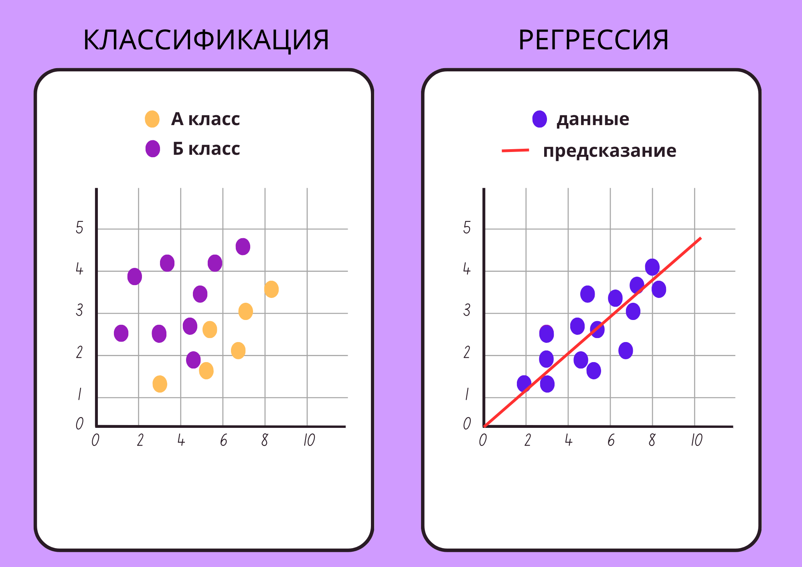

# LANCETNIC 3.0.0

[](https://pypi.org/project/lancetnic/)
[](https://pypi.python.org/pypi/lancetnic)
[](https://pepy.tech/project/lancetnic)
[](https://pypi.python.org/pypi/lancetnic)
[](https://opensource.org/licenses/MIT)

### LANCETNIC - это библиотека, которая представляет базовый набор для решения задач по поиску взаимосвязей между признаками объекта и целевой переменной.
Решение построено на парадигме обучения с учителем: модель обучается на размеченных данных, где каждому объекту сопоставлена соответствующая метка (целевая переменная).

<div align="center">

## Решаемые задачи


</div>

### Библиотека поддерживает два фундаментальных класса задач машинного обучения:
1) Задача классификации. Состоит в предсказании категориальной метки (класса) для объекта.
- Бинарная классификация (спам/не спам; выдача кредита/отказ в выдаче и т.д.)
- Многоклассовая классификация (определение тональности текста: позитивный/негативный/нейтральный и т.д.)
2) Задача регрессии. Состоит в предсказании непрерывной числовой величины. (прогнозирование рыночной стоимости недвижимости, оценка времени доставки заказов и т.д.)

### Функциональные возможности.
LANCETNIC предоставляет комплексный набор инструментов для полного цикла машинного обучения:
- предварительная обработка и векторизация данных;
- обучение модели на размеченных выборках;
- визуализация ключевых метрик качества после завершения обучения (для объективной оценки точности модели);
- инференс - применение обученной модели к новым данным.

Библиотека поддерживает работу как с чисто текстовыми данными, так и с гибридными наборами, включающими комбинации различных типов информации.

### Ключевые преимущества.
- Эффективность обучения - библиотека обеспечивает высокую скорость обучения моделей при сохранении удобства использования.
- Низкие аппаратные требования - в отличие от крупных языковых моделей (LLM), LANCETNIC не предъявляет высоких требований к вычислительным ресурсам, что делает её доступной для широкого круга пользователей и сценариев.
- Персонализация под данные пользователя - возможность обучения моделей на собственных размеченных наборах данных, что обеспечивает адаптацию к специфике конкретной предметной области.

## 🚀 Установка:
Установка с помощью CUDA

Для работы с графическим процессором рекомендуется установить PyTorch с поддержкой CUDA (ОПЦИОНАЛЬНО):

```bash
pip install torch==2.5.1+cu124 --index-url https://download.pytorch.org/whl/cu124
```

Затем установка lancetnic:

```bash
pip install lancetnic
```

## 👥 Авторы

- [Lancet52](https://github.com/Lancet52)

## 📄 [Документация](./lancetnic/docs/RU_documentation.md)