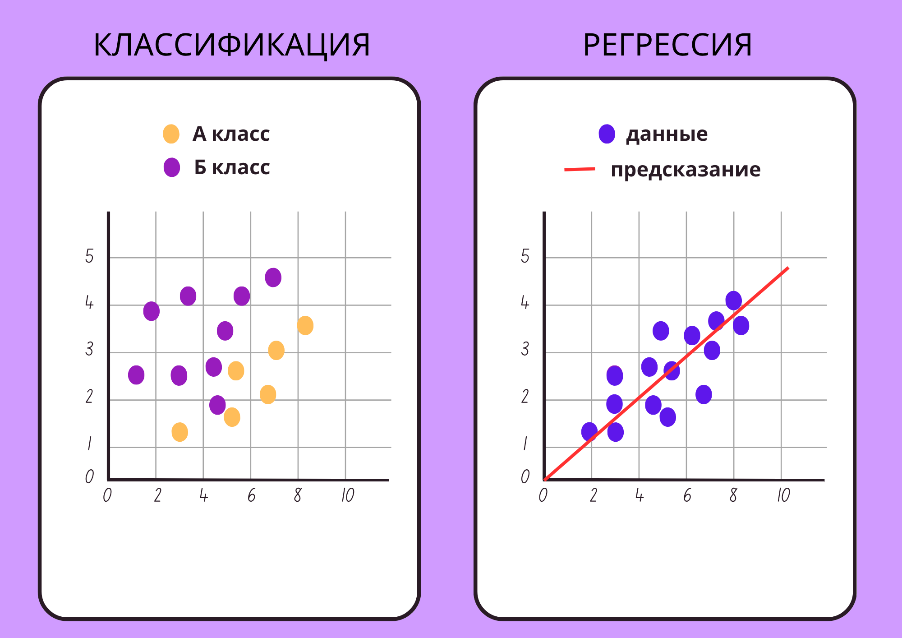

# LANCETNIC 4.1.0

[](https://pypi.org/project/lancetnic/)
[](https://pypi.python.org/pypi/lancetnic)
[](https://pepy.tech/project/lancetnic)
[](https://pypi.python.org/pypi/lancetnic)
[](https://opensource.org/licenses/MIT)

### LANCETNIC - это библиотека, которая представляет базовый набор для решения задач по поиску взаимосвязей между признаками объекта и целевой переменной.
Решение построено на парадигме обучения с учителем: модель обучается на размеченных данных, где каждому объекту сопоставлена соответствующая метка (целевая переменная).

Официальный сайт: https://lancetnic.ru/

<div align="center">

## Решаемые задачи


</div>

### Библиотека поддерживает несколько классов задач машинного обучения:

#### 1. Задача классификации
Состоит в предсказании категориальной метки (класса) для объекта.
- **Бинарная классификация** (спам/не спам; выдача кредита/отказ в выдаче и т.д.)
- **Многоклассовая классификация** (определение тональности текста: позитивный/негативный/нейтральный и т.д.)

#### 2. Задача регрессии
Состоит в предсказании непрерывной числовой величины.
- Прогнозирование рыночной стоимости недвижимости
- Оценка времени доставки заказов
- Предсказание любых количественных показателей

#### 3. Многозадачное обучение (Multi-Task Learning)
Одновременное решение задач классификации и регрессии на одном наборе данных.
- Совместное прогнозирование категории и числового значения
- Оптимизация нескольких целей одновременно
- Настраиваемое соотношение потерь для каждой задачи


## 🛠 Функциональные возможности

LANCETNIC предоставляет комплексный набор инструментов для полного цикла машинного обучения:

- **Предварительная обработка и векторизация данных**
  - Поддержка текстовых данных через TF-IDF векторизацию
  - Поддержка числовых признаков с масштабированием
  - Гибридная обработка комбинированных данных
  
- **Обучение модели на размеченных выборках**
  - Автоматическое разделение на обучающую и валидационную выборки
  - Настраиваемые гиперпараметры (размер скрытого слоя, количество слоев, dropout)
  - Выбор оптимизатора (Adam, SGD, RMSprop)
  - Выбор функции потерь (CrossEntropyLoss и MSELoss)
  
- **Визуализация ключевых метрик качества**
  - Матрица ошибок (Confusion Matrix) для классификации
  - Графики динамики потерь (Train/Val Loss)
  - Графики точности (Train/Val Accuracy)
  - F1-score, Precision, Recall для классификации
  - MAE, RMSE для регрессии
  - Scatter plot с линией регрессии
  - Распределение классов в датасете
  
- **Инференс** - применение обученной модели к новым данным

Библиотека поддерживает работу как с чисто текстовыми данными, так и с гибридными наборами, включающими комбинации различных типов информации.

## 🏗 Архитектуры моделей

### Модели для классификации:
- **ScalpelMC** - полносвязная нейронная сеть для многоклассовой классификации
- **LancetMC** - LSTM-сеть для работы с последовательностями
- **LancetMCA** - LSTM с механизмом внимания (Attention)
- **LancetMCA_gru** - GRU с механизмом внимания

### Модели для регрессии:
- **ScalpelReg** - полносвязная нейронная сеть для регрессии
- **LancetReg** - LSTM-сеть для регрессии на последовательностях

### Модели для многозадачного обучения:
- **ScalpelMTSK** - мультимодель, объединяющая классификацию и регрессию

## ✨ Преимущества

- **Эффективность обучения** - библиотека обеспечивает высокую скорость обучения моделей при сохранении удобства использования
- **Низкие аппаратные требования** - в отличие от крупных языковых моделей (LLM), LANCETNIC не предъявляет высоких требований к вычислительным ресурсам, что делает её доступной для широкого круга пользователей и сценариев
- **Персонализация под данные пользователя** - возможность обучения моделей на собственных размеченных наборах данных, что обеспечивает адаптацию к специфике конкретной предметной области
- **Автоматическое сохранение результатов** - все метрики, графики и модели сохраняются автоматически в структурированные папки
- **Гибкая настройка** - полный контроль над архитектурой модели и параметрами обучения

## 🚀 Установка:
Установка с помощью CUDA

Для работы с графическим процессором рекомендуется установить PyTorch с поддержкой CUDA (ОПЦИОНАЛЬНО):

```bash
pip install torch==2.5.1+cu124 --index-url https://download.pytorch.org/whl/cu124
```

Затем установка lancetnic:

```bash
pip install lancetnic
```

## 👥 Авторы

- [Lancet52](https://github.com/Lancet52)
- e-mail для связи: `lancetFPV@yandex.ru`

## 📄 [Документация](https://github.com/Lancet52/lancetnic/blob/main/lancetnic/docs/images/RU_documentation.md)